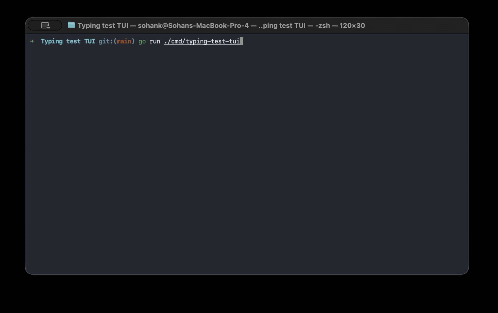

# Sohan's Typing Test TUI

A minimal Monkeytype-inspired terminal typing test built with Go, Bubble Tea,
Bubbles, and Lip Gloss.



## Run

```sh
go run ./cmd/typing-test-tui
```

Completed tests are saved to `typing_history.csv` in the current working
directory.

## Controls

On the home screen:

- `t` opens Tests.
- `p` opens Past Results.
- `wasd` or arrow keys change the focused Tests option.
- `enter` confirms the focused Tests option.
- `ctrl+q` quits.

During countdown:

- Typing is ignored.
- `ctrl+q` returns home without saving.
- `ctrl+r` restarts the countdown with fresh text.

During a test:

- Printable keys are typed input, including `q`, `r`, `t`, `p`, and `wasd`.
- `enter` types a newline for code prompts.
- `tab` inserts four spaces for code prompts.
- `backspace` edits the current segment, or returns to the previous segment when
  pressed at the start of a non-first segment.
- Arrow keys are ignored.
- `ctrl+q` returns home without saving.
- `ctrl+r` restarts from the countdown with the same settings and fresh text.

## Modes

Languages: English, Python, Java, C, JavaScript.

Durations: 15, 30, 60, 120 seconds.

## Prompts

Prompt records live in `internal/prompts/data`, with one language-specific file
per typing mode. Each non-empty line is a prompt record chosen randomly; use
escaped `\n` in code prompt files for multi-line text and four spaces for
indentation.
